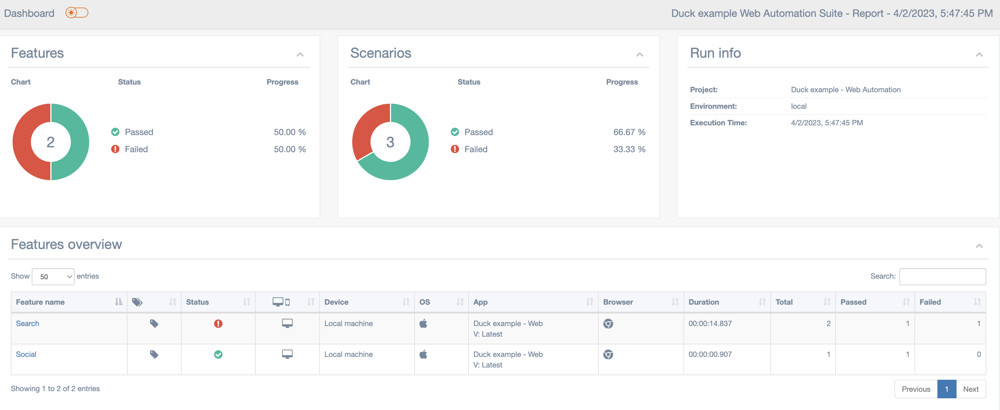

# cypress-example
Cypress example repository - Testing some features of the "https://duckduckgo.com" page

## Framework Setup

* Make sure you have installed node (**node version should be 18**).
* After clonning the repository run:
```bash
npm install
```

## Available npm commands 

The available npm commands are defined in [package.json](package.json)

To run any of the commands, execute from a terminal:

```bash 
npm run <command>
```

For example, to run all the test cases defined in the suit, execute:
```bash 
npm run testHeaded
```

The available commands are:

* `open`: To open cypress
* `test`: To run cypress
* `testHeadless`: To run tests in headedless
* `testHeaded`: To run tests in headed mode
* `generateReport`: To generate HTML report

When running any of the commands, the cypress configuration used by default is defined in [cypress.json](cypress.json)

To specify an additional argumet to a command, then run the command followed by "`--`" and then the desired arguments:

```bash 
npm run <command> -- <command_args>
```

For example, to run only test tagged as "@Login" in headed mode, then execute:

```bash 
npm run testHeaded -- -e TAGS="@Social"
```

### How to run only the test case you are working on

After wirting the new sceanrio, you can add a unique tag temporary to that test case, for example `@test`.

Then you can run the following command to have cypress test runner opened and only execute the test case you are working on:

```bash 
npm run open -- -e TAGS="@test"
```

## Generating html report

After running the suite, it is possible to generate an HTML report that includes information per feature and per scenario.

This script will take as input the files stored in `cucumbet-json` and `screenshots` directories. The content of those folder is automatically generated when running the test suite.

The script to generate the report is:

```bash
npm run generateReport -- --help
```

* `--help`: Shows help

* `--env`: The environment used when the test suite run [default: local]

* `--browser`: The browser used when the test suite run [default: chrome]

* `--reportDir`: The directory where the report output will be stored [default: ./cypress/maa-reports]


For example, to generate a result with the previous test suite run output:

```bash
npm run generateReport
```


